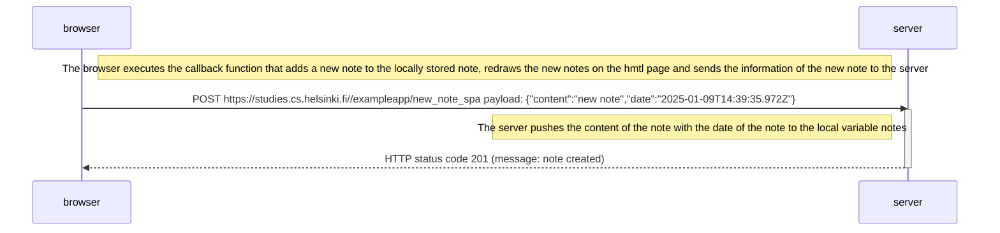

```mermaid
sequenceDiagram
    participant browser
    participant server

    Note right of browser: The browser executes the callback function that adds a new note to the locally stored note, redraws the new notes on the hmtl page and sends the information of the new note to the server

    browser->>server: POST https://studies.cs.helsinki.fi//exampleapp/new_note_spa payload: {"content":"new note","date":"2025-01-09T14:39:35.972Z"}
    activate server
    Note left of server: The server pushes the content of the note with the date of the note to the local variable notes
    server-->>browser: HTTP status code 201 (message: note created)
    deactivate server
```